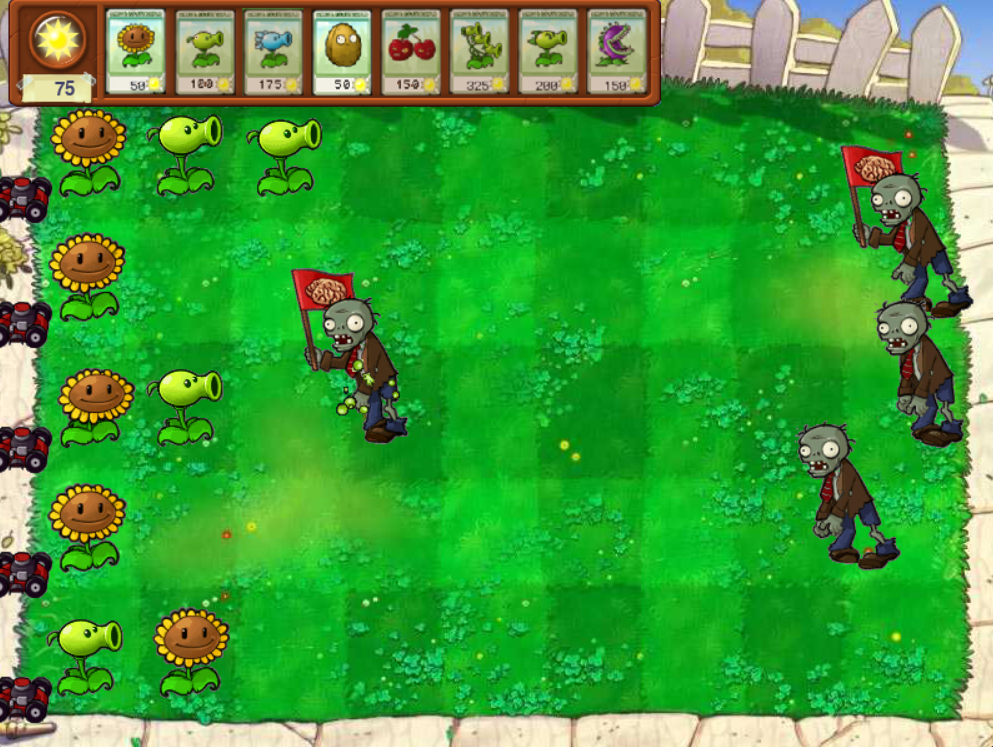
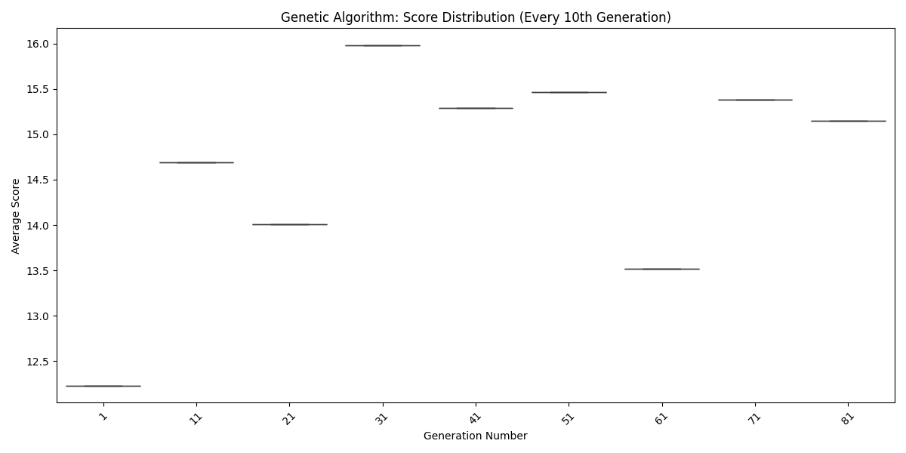
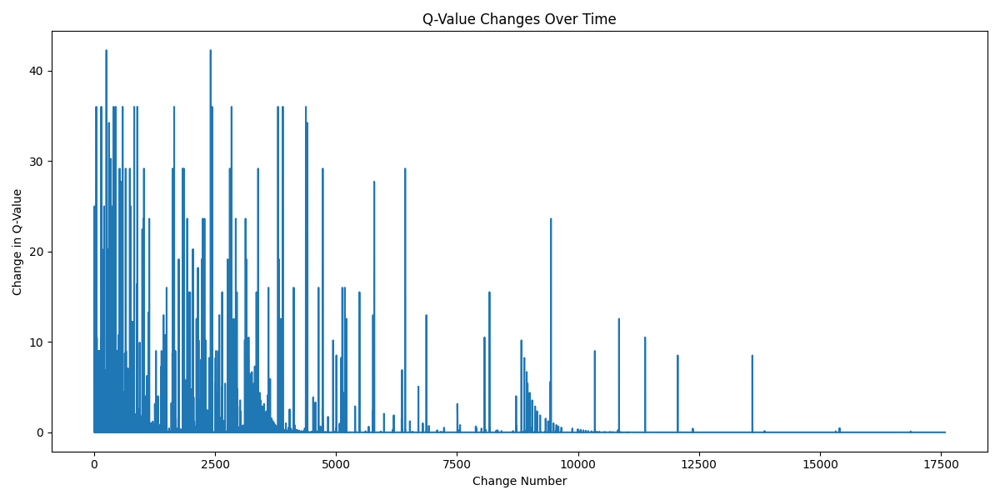
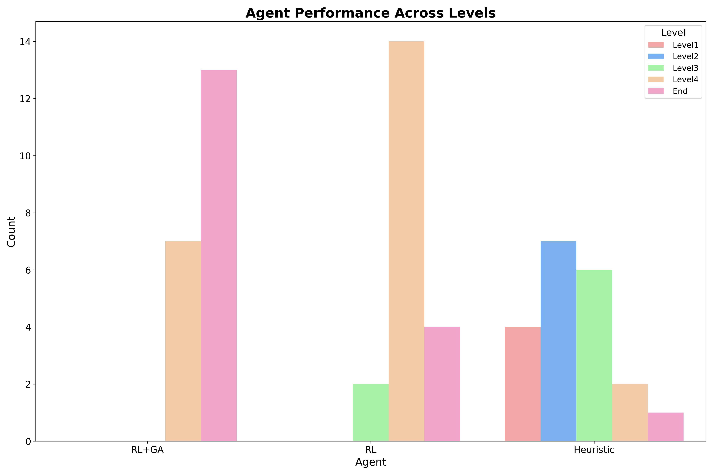
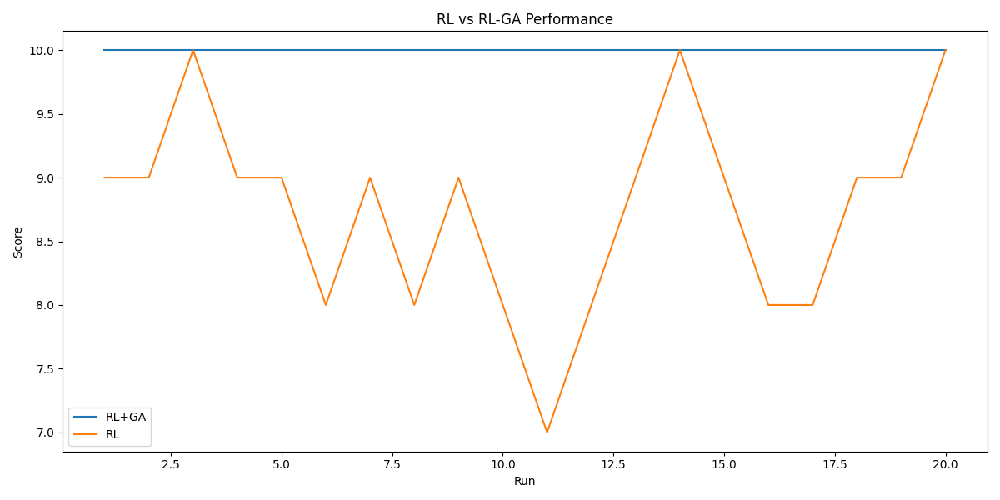

# Plants vs. Zombies AI Agent

This project implements an AI agent that plays the game Plants vs. Zombies using a combination of Reinforcement Learning (RL) and Genetic Algorithm (GA) techniques. The agent learns to make strategic decisions about plant placement and resource management to defend against incoming zombie waves.

## Table of Contents
- [Project Overview](#project-overview)
- [Features](#features)
- [How It Works](#how-it-works)
- [Installation](#installation)
- [Usage](#usage)
- [Results](#results)
- [Contributing](#contributing)
- [License](#license)

## Project Overview

This AI agent is designed to play a Python implementation of Plants vs. Zombies. It uses two main AI techniques:

1. **Reinforcement Learning (RL)**: Used for deciding the best action to take in each row of the game grid.
2. **Genetic Algorithm (GA)**: Used for selecting the most urgent row that requires action.

The combination of these techniques allows the agent to make both tactical (per-row) and strategic (across-row) decisions.



## Features

- Reinforcement learning for optimal plant placement within rows
- Genetic algorithm for prioritizing rows based on threat level
- Adaptive strategy based on current game state
- Support for multiple plant types and zombie types
- Configurable parameters for fine-tuning AI behavior

## How It Works

### Reinforcement Learning
The RL component uses Q-learning to determine the best action for a given row state. Actions include:
- Placing different types of plants (attackers, defenders, sunflowers, bombers)
- Collecting sun
- Doing nothing

The state of each row is represented by features such as:
- Number of plants
- Number of zombies
- Zombie proximity
- Sun count

### Genetic Algorithm
The GA component evolves a set of weights used to evaluate the urgency of each row. It considers factors like:
- Zombie count and proximity
- Defensive/Attacking plants
- Whether the row has a car

## Installation

1. Clone this repository:
   ```
   git clone https://github.com/yourusername/pvz-ai-agent.git
   ```
2. Install the required dependencies:
   ```
   pip install -r requirements.txt
   ```

## Usage

The AI agent can be run in several different modes with adjustable game speed. You can also choose to randomize the game setup.

To run the program, use the following command format:

```
python main.py <mode> <speed> [random]
```

Where:
- `<mode>` can be one of: "manual", "train", "rl", "ga", "heu", or "rl-ga"
- `<speed>` is a number between 1 and 20 (1 being the slowest, 20 being the fastest)
- `[random]` is an optional parameter to randomize the game setup

### Modes:

- **manual**: Play the game manually without AI assistance.
- **train**: Train the AI agent using reinforcement learning and genetic algorithm techniques.
- **rl**: Run the game with a reinforcement learning agent.
- **ga**: Run the game with a genetic algorithm agent.
- **heu**: Run the game with a heuristic agent.
- **rl-ga**: Run the game with a combined reinforcement learning and genetic algorithm agent.

### Examples:

1. To run the game in manual mode at normal speed:
   ```
   python main.py manual 1
   ```

2. To train the AI agent at a fast speed:
   ```
   python main.py train 20
   ```

3. To watch the RL-GA agent play at a moderate speed with randomized setup:
   ```
   python main.py rl-ga 10 random
   ```
4. To run the heuristic agent at a slow speed:
   ```
   python main.py heu 5
   ```
5. To run the genetic algorithm agent at maximum speed:
   ```
   python main.py ga 20
   ```
Note: Adjust the speed parameter to control the game's pace according to your preference or training needs. Use the "random" option if you want to test the agents on varied game setups. It is recommended not to run the game faster than 5.
### Mode Descriptions:

- **manual**: Play the game manually without AI assistance.
- **train**: Train the AI agent using reinforcement learning and genetic algorithm techniques.
- **agent**: Watch the trained AI agent play the game autonomously.

Adjust the speed parameter to control the game's pace according to your preference or training needs.

### Training Progress
Some graphs showing the change in the Genetic algorithm and the game score:



A graph showing the change in the q_values over time:



### Win Rate and Results
We tested our agent results against other agents:
- Heuristic - A model that choose the most urgent row based on the closest zombie and make a random action.
- RL- The model which trained on the rows actions, but choose the most urgent row based on the closest zombie.




## Contributing
Contributions to improve the AI agent are welcome! Please follow these steps:

1. Fork the repository
2. Create a new branch (`git checkout -b feature/amazing-feature`)
3. Make your changes
4. Commit your changes (`git commit -m 'Add some amazing feature'`)
5. Push to the branch (`git push origin feature/amazing-feature`)
6. Open a Pull Request

---

**Note:** This project is for educational purposes only and is not affiliated with, endorsed, or sponsored by the creators of Plants vs. Zombies.
